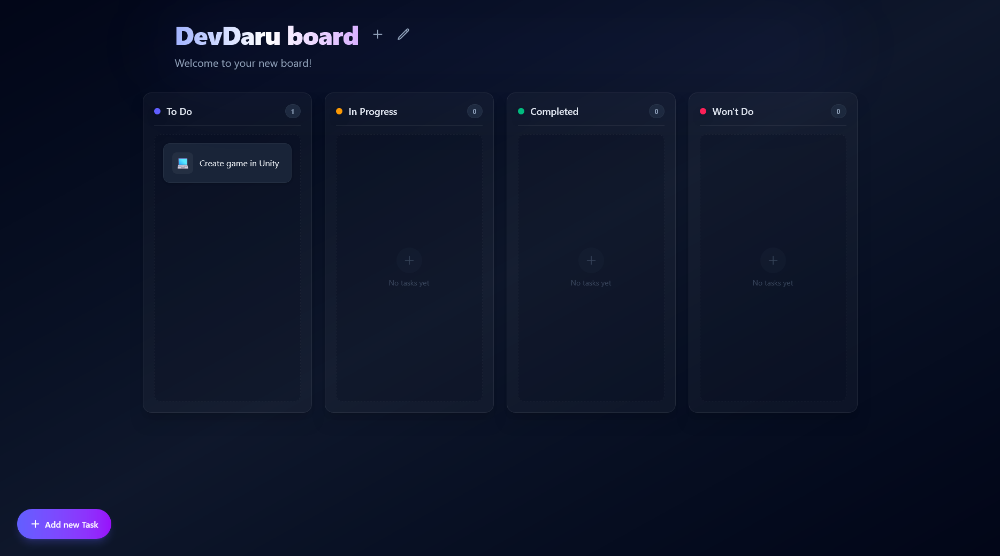
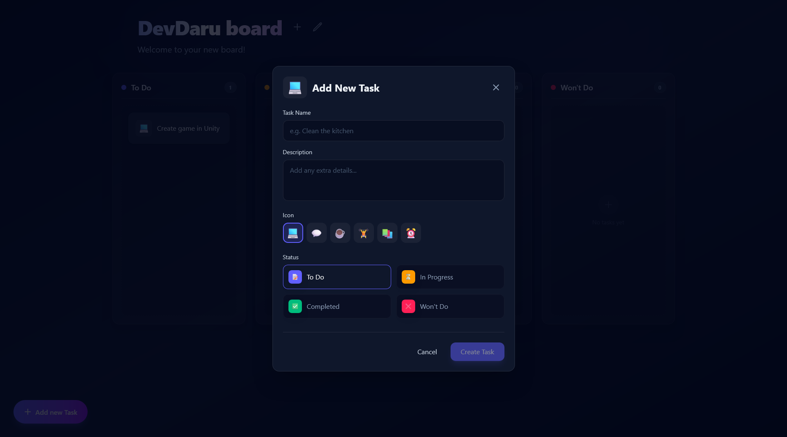

# Boardly - Task Board

A beautiful and responsive web application designed for task management and organization.

Create custom workspaces, track your progress, and seamlessly manage tasks across different stages. Boardly provides an intuitive interface to help you stay productive and organized without a complicated setup.

> **Live Demo:**
> [https://boardly-devdaru.vercel.app](https://boardly-devdaru.vercel.app)
>
> **Important Note:**
> The backend may take up to 50 seconds to wake up on the first request. Please be patient!

---

## Screenshots  

| Board View | Task Editor |
|:---:|:---:|
|  |  |


## Features

* **Instant Workspace Creation:** Generate a new personalized task board instantly and access it via a unique link.
* **Comprehensive Task Management:** Create, edit, delete, and categorize tasks across four distinct statuses (To Do, In Progress, Completed, Won't Do).
* **Board Customization:** Easily edit the board's name and description.
* **Beautiful UI:** Sleek, modern aesthetic featuring gradient backgrounds, glowing elements, and responsive design courtesy of Tailwind CSS.
* **REST API Integration:** Fully integrated with a backend service to ensure robust data persistence.

## Tech Stack

* 
* 
* 

---

## How to use / Quick Start

Get started right away without needing to set anything up:

1. Visit the live site link.
2. Wait a few seconds for Boardly to provision a fresh, unique workspace for you.
3. Bookmark or save the generated URL to re-access your board later.
4. Click "Add new Task" to start managing your workflow!

---

## Local Development

Instructions for developers who want to run the Boardly frontend locally and edit the code.

### Prerequisites
* Node.js (version 18 or higher recommended)
* npm (Node Package Manager)

### Steps
1. Clone the repository:
   ```bash
   git clone [Repository Link]
   ```
2. Navigate to the frontend directory:
   ```bash
   cd Boardly-task-board/frontend
   ```
3. Install dependencies:
   ```bash
   npm install
   ```
4. Configure environment variables:
   Create a `.env` file in the root of the `frontend` folder and set the backend API URL:
   ```env
   VITE_API_URL=http://localhost:5000
   ```
5. Run the development server:
   ```bash
   npm run dev
   ```
   The application should now be accessible at `http://localhost:5173`.

## License

This project is licensed under the MIT License - see the [LICENSE](LICENSE) file for details.

## Author

Project created by [@DevvMarko](https://github.com/DevvMarko) and I invite you to visit the author's portfolio page [mbarchanski.pl](https://mbarchanski.pl)
